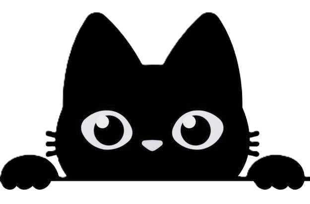
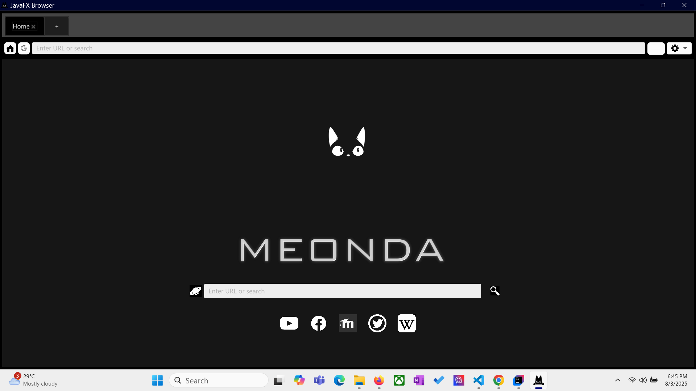
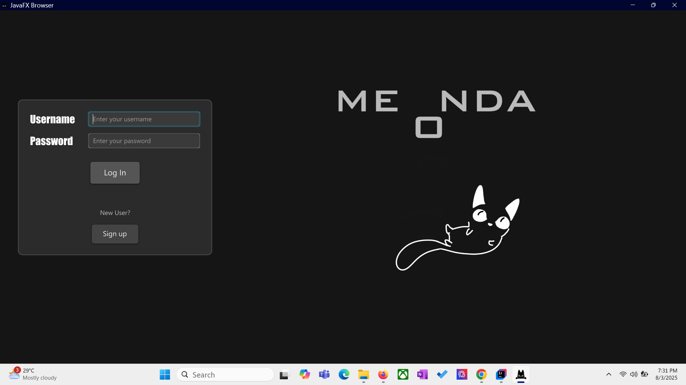
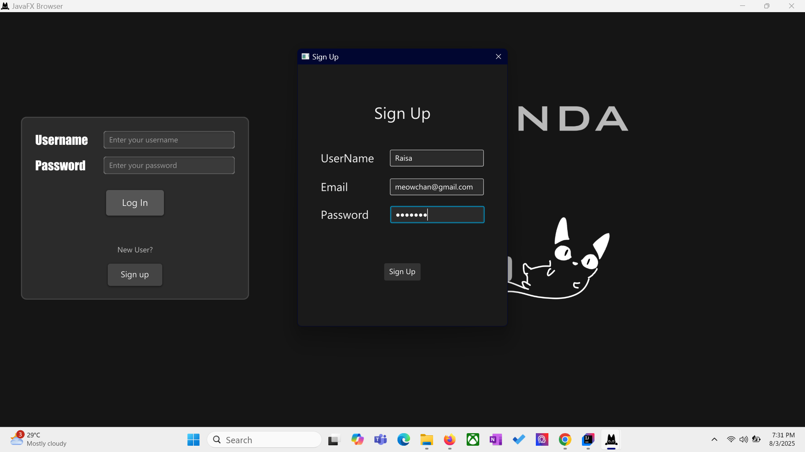
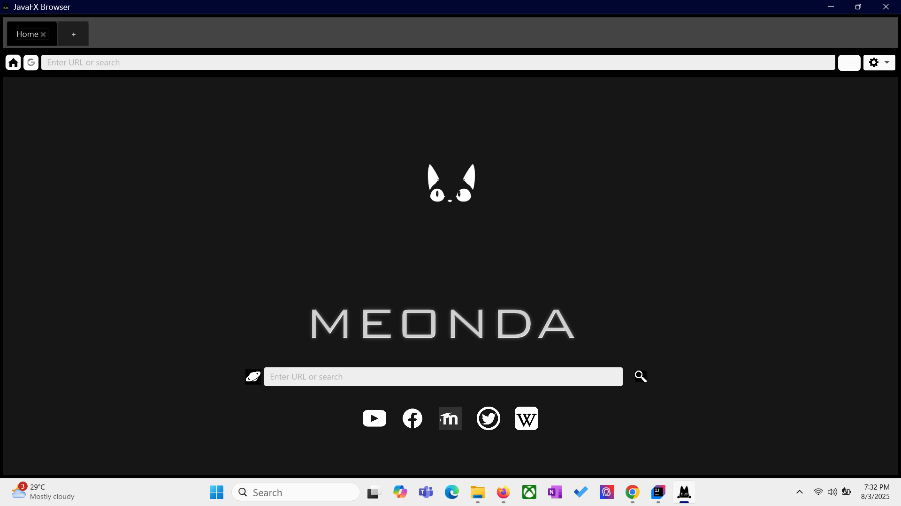
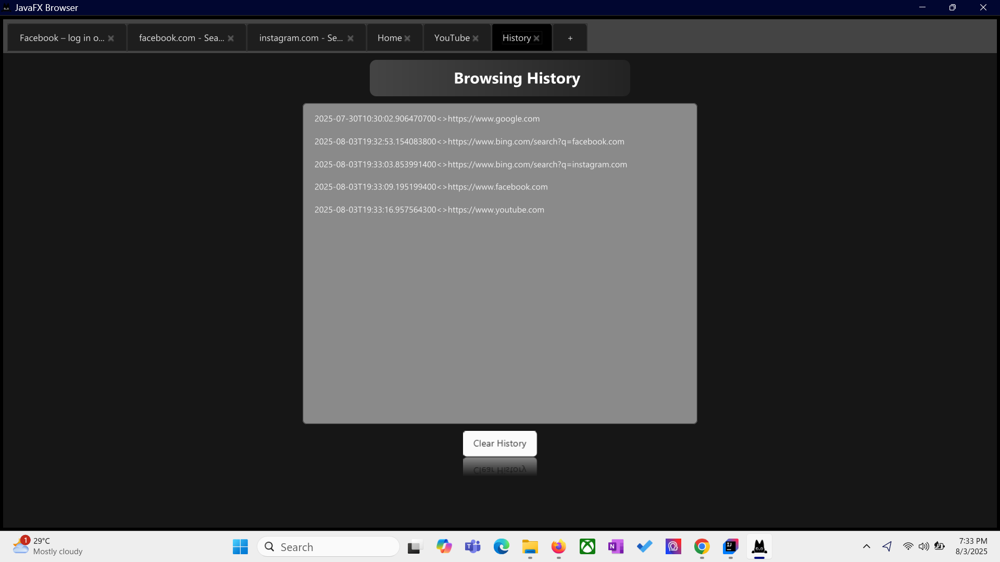
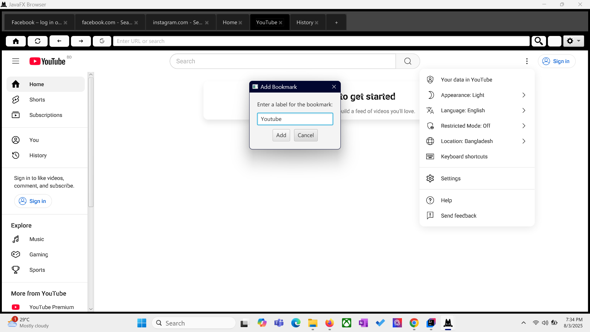

#  Meonda Web Browser 

## Overview

Meonda Web Browser is a javafx based desktop application.

## Browser Interface






## Viewing History


## Saving Bookmark


## Team Members

- Rubaiyat Zaman Raisa
- Afia Jahin Adhitee
  
## Features

- Different profiles
- Saving browser history based on your profile
- Saving bookmarks to your profile


## Project Structure

```
Meonda/
├── src/
│   ├── main/
│   │   ├── java/
│   │   │   ├── com/
│   │   │   │   ├── Browser/
│   │   │   │   │   ├── BookMarkController.java
│   │   │   │   │   ├── BrowserController.java
│   │   │   │   │   ├── Downloader.java
│   │   │   │   │   ├── HistoryController.java
│   │   │   │   │   ├── HomeViewController.java
│   │   │   │   │   ├── LogInController.java
│   │   │   │   │   ├── Server.java
│   │   │   │   │   ├── SharedController.java
│   │   │   │   │   ├── SignUpController.java
│   │   │   │   │   ├── TabController.java
│   │   │   │   │   ├── UserInfoStore.java
│   │   ├── resources/
│   │   │   ├── com/
│   │   │   ├── fxml/
│   │   │   ├── img/
│   │   │   ├── png/ 
├── README.md
└── .gitignore
└── .env
```
## Technologies Used

- Java
- JavaFX
- javawebview


All team members contributed to the development of the Evoza Web Browser. Special thanks to Biplov Gautam for leading the team as the Scrum Master.

